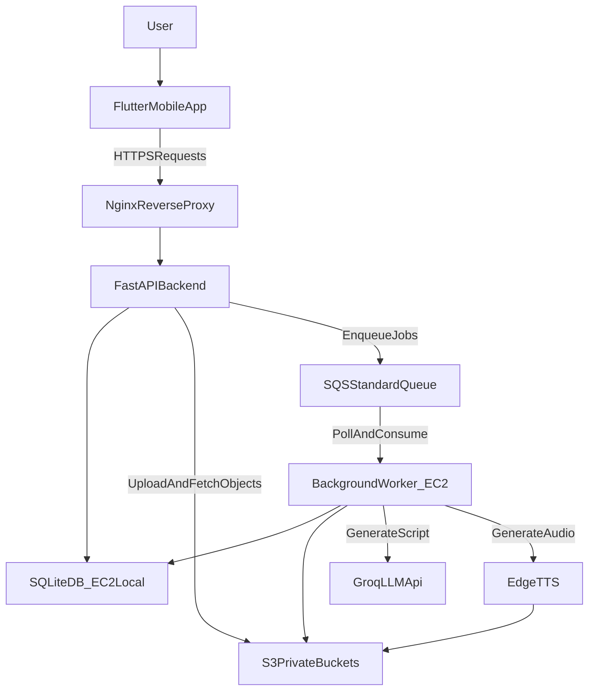
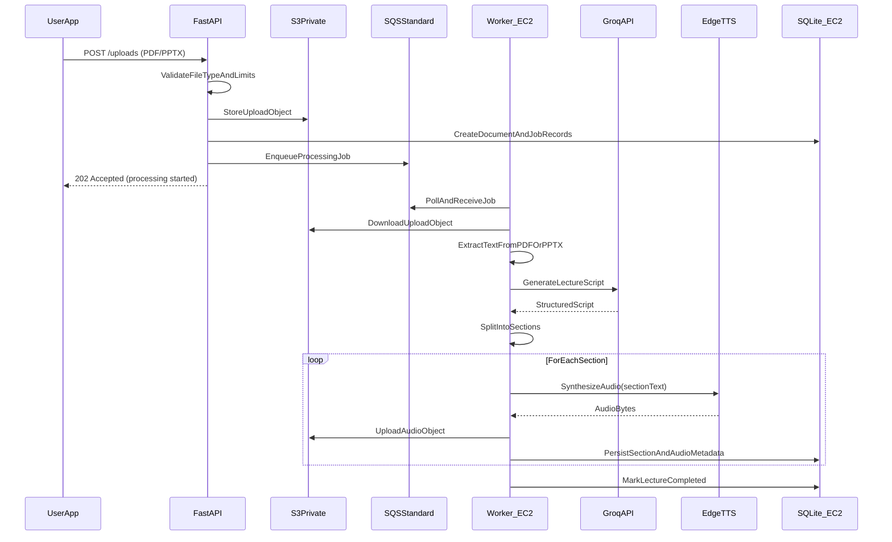
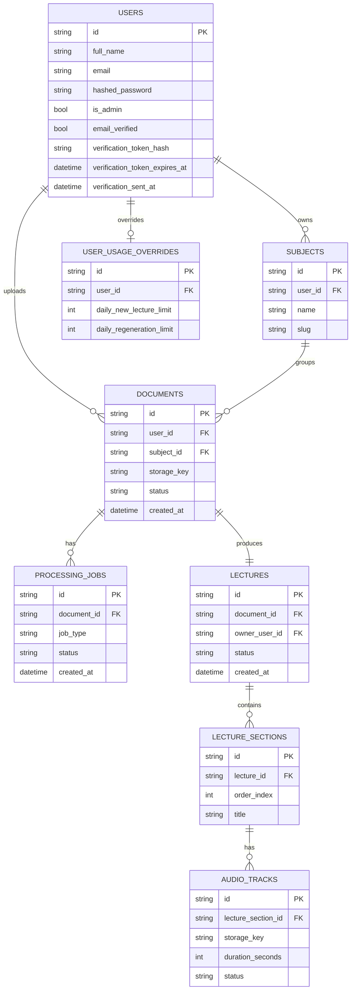

Project Report

Sage AI – PDF and PPTX Notes to Audio Lectures

Submitted By

Syed Muhammad Baqir Hassan Naqvi

BSCS_22_55 (Morning)

Session: 2022 – 2026

Supervised By

Dr. Khawaja Tehseen

Assistant Professor,

Department of Computer Science

DEPARTMENT OF COMPUTER SCIENCE

BAHAUDDIN ZAKARIYA UNIVERSITY MULTAN

PAKISTAN

## FINAL APPROVAL

This is to certify that we have read this report submitted by Syed Muhammad Baqir Hassan Naqvi and it is our judgment that this report is of sufficient standard to warrant its acceptance by Bahauddin Zakariya University, Multan for the degree of BS (Computer Science).

Committee:

1. External Examiner _____________________

<<Examiner Name>>

<<Designation>>

<<Organization>>

2. Supervisor _____________________

Dr. Khawaja Tehseen

Assistant Professor,

Department of Computer Science

3. Head of Department _____________________

Dr. Minhaj Ahmad

Associate Professor,

Department of Computer Science

## DEDICATION

To my loving parents, ever-supporting teachers, and the friends who helped me navigate through these four years of study.

## ACKNOWLEDGEMENT

I first of all give thanks to Allah Almighty for His utmost blessings upon me and for granting me the courage and capability to complete this degree and especially this final year project. My sincere gratitude goes to my parents and family members who prayed for me and provided constant support throughout my academic journey.

I wish to express my deepest thanks to my project supervisor, Dr. Khawaja Tehseen, for his constant motivation, expert guidance, and invaluable assistance during the project work. His insights were instrumental in shaping both the system design and the overall direction of this project. I also extend my thanks to the other faculty members of the Department of Computer Science, Bahauddin Zakariya University Multan, for their cooperation and encouragement throughout my degree program.

Syed Muhammad Baqir Hassan Naqvi

## PROJECT BRIEF

PROJECT NAME

Sage AI – PDF and PPTX Notes to Audio Lectures

UNDERTAKEN BY

Syed Muhammad Baqir Hassan Naqvi

ROLL NUMBER

BSCS_22_55

SUPERVISED BY

Dr. Khawaja Tehseen

DEPARTMENT

Department of Computer Science

UNIVERSITY

Bahauddin Zakariya University Multan

SESSION

2022 – 2026

HARDWARE USED

PC, Ryzen 5 3600, RX 5600XT, 16 GB RAM

OPERATING SYSTEM

Windows 10 / Ubuntu

FRONTEND

Flutter (Dart), flutter_bloc, just_audio

BACKEND

FastAPI (Python), SQLAlchemy, Pydantic

AI / PROCESSING

Groq API (LLM), Text Extraction Libraries, TTS Engine

CLOUD INFRASTRUCTURE

AWS EC2 (single-instance API + worker), AWS S3 (private buckets), AWS SQS (Standard queue), Nginx, Certbot

DATABASE

SQLite via SQLAlchemy ORM (hosted on the EC2 instance for cost reduction; PostgreSQL/RDS remains a scalable alternative)

## TABLE OF CONTENTS

Chapter 1 – Introduction

1.1 Project Introduction

1.1.1 Scope of the Project

1.1.2 Objectives of the Project

1.2 Project Overview

Chapter 2 – System Analysis & Design

2.1 System Analysis

2.1.1 Existing System

2.1.2 Problems in Existing System

2.1.3 Proposed System

2.1.4 System Requirements Specification

2.2 System Design

2.2.1 Proposed System Architecture

2.2.2 Proposed System in User’s Perspective

2.3 System Design Using UML

2.3.1 Use Case Diagram

2.3.2 Sequence Diagram

2.4 Database Design

2.4.1 Entity Relationship Diagram (ERD)

2.4.2 Relational Model

Chapter 3 – System Development & Implementation

3.1 System Development

3.1.1 Architecture Design Pattern

3.1.2 Tool and Technology Selection

3.1.3 System Modules Implementation

3.2 System Implementation

3.2.1 Backend Implementation

3.2.2 Frontend Implementation

3.2.3 AI Processing Implementation

3.2.4 Cloud Deployment Implementation

3.2.5 Security Implementation

3.3 System Testing

3.4 Summary of Implementation

Chapter 4 – User’s Guide

4.1 System Overview

4.2 User Registration and Login

4.3 Home Dashboard

4.4 Document Upload

4.5 Lecture Processing Status

4.6 Lecture Library

4.7 Lecture Playback

4.8 Subject Management

4.9 Lecture Regeneration

4.10 Profile Module

## Chapter 1 INTRODUCTION

### 1.1 Project Introduction

The rapid proliferation of digital education has fundamentally changed how students engage with academic content. Learners increasingly rely on electronic resources such as PDF documents and PowerPoint presentations to access lecture material. While these formats are well-suited for visual consumption, they present significant limitations for students who prefer audio-based learning, require accessibility accommodations, or need to revise content during activities such as commuting or exercise.

Traditional study workflows require students to read and mentally process large volumes of text, an approach that is time-consuming and poorly suited to passive revision. Furthermore, the task of converting written notes into spoken, teacher-style explanations demands considerable effort and rarely produces consistent results without professional support.

To address these limitations, this project presents Sage, an AI-powered system designed to automatically transform educational notes into structured, narrated audio lectures. By uploading lecture materials in PDF or PowerPoint format, users receive a fully generated audio lecture that explains the content in a natural, teacher-like voice. The platform integrates modern technologies including natural language processing, text extraction, and text-to-speech synthesis to deliver a seamless learning experience.

#### 1.1.1 Scope of the Project

The scope of this project encompasses the full design and implementation of a system capable of converting static educational documents into audio-based lectures. The system is developed as a full-stack mobile application with a cloud-deployed backend.

The system supports the following core functionalities:

Uploading lecture notes in PDF and PPTX formats

Extracting readable text from uploaded files

Generating structured lecture scripts using an AI language model

Converting lecture scripts into narrated audio output

Providing an in-app interface for lecture playback

Organizing lectures based on user-defined subjects

Managing user accounts and personal lecture libraries

Supporting lecture regeneration for improved output

The project is limited to handling structured, digitally-created educational content. It does not support handwritten notes, scanned image-based PDFs, or legacy PowerPoint (.ppt) file formats.

#### 1.1.2 Objectives of the Project

The primary objective of this project is to develop an intelligent system that automates the conversion of educational notes into high-quality audio lectures. The specific objectives are as follows:

To design and develop a user-friendly mobile platform for uploading and managing lecture materials

To implement a reliable text extraction mechanism for PDF and PPTX files

To generate meaningful and coherent lecture scripts using AI-based language models

To convert generated scripts into natural, high-quality audio narration

To enable users to listen to generated lectures within the mobile application

To organize lectures using a subject-based grouping system

To ensure efficient handling of long-running AI tasks using asynchronous background processing

To deploy the system on scalable cloud infrastructure for reliability and performance

### 1.2 Project Overview

The proposed system, Sage, follows a client-server architecture consisting of a mobile application frontend and a cloud-deployed backend API server. The frontend is developed using Flutter and provides features including user authentication, document upload, lecture browsing, and audio playback. The backend is implemented using FastAPI and handles all business logic, file processing, and communication with cloud services.

When a user uploads a document, the file is stored in cloud storage and a background processing job is automatically initiated. The document is parsed to extract its textual content, which is then sent to an AI language model to generate a structured lecture script. The script is divided into logical sections, and each section is independently converted into audio using a text-to-speech service. The resulting audio files are stored in cloud storage and made accessible to the user through the application.

To ensure scalability and responsiveness, the system uses asynchronous processing through a queue-based architecture. Cloud services including object storage and message queues are employed to manage files and background jobs efficiently. The overall system delivers a fully automated pipeline from document upload to playable audio lecture.

## Chapter 2 SYSTEM ANALYSIS & DESIGN

### 2.1 System Analysis

System analysis is a critical phase in the software development lifecycle. It involves studying the problem domain, identifying limitations in existing approaches, and defining the requirements of a proposed solution. In the context of this project, the analysis phase examines how students currently interact with lecture materials and identifies inefficiencies that prevent flexible, accessible learning. The findings of this analysis directly motivate the design of the Sage system.

#### 2.1.1 Existing System

The current approach to studying lecture material relies predominantly on static document formats such as PDF files and PowerPoint presentations. These formats are widely adopted in academic institutions due to their simplicity and ease of distribution. In practice, students must manually read notes, interpret content independently, and re-read material during revision periods.

While these formats are effective for presenting structured information visually, they lack flexibility and do not natively support alternative learning modes. Students who prefer auditory learning, those managing visual impairments, or those who wish to revise while engaged in other activities face significant barriers when using static documents.

#### 2.1.2 Problems in Existing System

The traditional document-based study system presents several well-defined limitations:

Lack of Accessibility: Static documents provide no audio-based learning pathway, making them unsuitable for auditory learners or users with visual impairments.

Time-Consuming Process: Students must manually read and interpret large volumes of text, which is inefficient during high-pressure revision periods.

No Automation: There is no automated mechanism available to convert notes into summarised or structured lecture formats.

Limited Learning Flexibility: Learning is restricted to visual engagement, preventing passive consumption during activities such as commuting or exercise.

Inconsistent Understanding: Without guided explanations, different students may interpret the same material in different ways, leading to gaps in understanding.

#### 2.1.3 Proposed System

To overcome the limitations identified above, the proposed system, Sage, introduces an AI-powered solution that transforms static lecture notes into dynamic, narrated audio lectures. The system removes the need for manual interpretation by using a large language model to generate teacher-style explanations from raw document content.

The proposed system allows users to upload lecture notes, receive automatically generated audio lectures, and listen to them within a mobile application. It introduces automation, accessibility, and flexibility into the learning process, enabling students to consume educational content in audio form regardless of their location or activity.

#### 2.1.4 System Requirements Specification

System requirements define the functional and non-functional aspects necessary for the successful operation of the Sage platform. Table 2.1 below summarises the major hardware and software requirements for the system.

Requirement

Specification

Processor

Dual-core 2.0 GHz or higher

RAM

4 GB or higher (8 GB recommended)

Storage

50 GB or higher for server deployment

Platform (Client)

Android / iOS (Flutter application)

Platform (Server)

AWS EC2 (Linux Ubuntu)

Backend Language

Python 3.10+

Frontend Language

Dart (Flutter)

Database

SQLite via SQLAlchemy ORM (hosted on EC2 for cost reduction; PostgreSQL/RDS remains a scalable alternative)

Cloud Services

AWS S3, AWS SQS, AWS EC2

Internet

Broadband connection (1 Mbps or above)

Table 2.1 Major System Requirements

Functional Requirements: The system must allow users to register and log in securely, enable uploading of PDF and PPTX files, extract textual content from uploaded files, generate lecture scripts using an AI language model, convert scripts into audio format, allow playback of generated lectures, and support organisation of lectures by subject.

Non-Functional Requirements: The system must handle multiple concurrent uploads efficiently (Performance), support increasing user load through cloud-based infrastructure (Scalability), ensure reliable background task completion (Reliability), protect user data and uploaded files (Security), and remain accessible with minimal downtime (Availability).

### 2.2 System Design

System design translates the requirements identified during analysis into a concrete blueprint for implementation. The Sage system follows a client-server architecture with cloud-based deployment, consisting of five major components: the frontend client, the backend API server, a cloud storage layer, an AI processing layer, and an asynchronous queue system.

#### 2.2.1 Proposed System Architecture

The system is structured into the following major components:

Frontend (Flutter Mobile Application): Provides the user interface for authentication, document upload, lecture browsing, and audio playback. Developed using Flutter to support both Android and iOS from a single codebase.

Backend (FastAPI Server): Handles all business logic and API requests. Manages users, documents, lectures, and subjects. In the cost-optimised deployment, a single AWS EC2 instance runs both the API server and the background worker, and hosts the SQLite database file locally. The service is deployed behind an Nginx reverse proxy with HTTPS enabled via Certbot.

Storage Layer (AWS S3): Stores uploaded documents and generated audio files in private buckets. Access is controlled by the backend (for example, through signed URLs or backend-mediated access) to prevent public exposure of user content.

Processing Layer: Handles text extraction from PDF and PPTX files, script generation via the Groq LLM API, and audio generation using a TTS engine. Runs inside background worker processes.

Queue System (AWS SQS): Uses an AWS SQS Standard queue to distribute asynchronous processing jobs on a first-come-first-served basis. This ensures the API remains responsive while long-running AI operations are executed in the background.

Fig 2.1 Proposed System Architecture

#### 2.2.2 Proposed System in User's Perspective

From the user's perspective, the system operates as follows:

User logs into the mobile application

User selects a subject and uploads a lecture note file (PDF or PPTX)

System processes the file in the background without requiring user intervention

User is notified when the audio lecture is ready

User plays, pauses, or skips through the generated audio lecture by section

This workflow ensures minimal effort from the user while delivering a fully processed audio lecture as output.

### 2.3 System Design Using UML

Unified Modeling Language (UML) provides a standardised set of diagrams for visualising system behaviour and structure. The following diagrams have been used to represent the Sage system.

#### 2.3.1 Use Case Diagram

The Use Case Diagram represents the interactions between users and the system. The primary actor is the User, who interacts with the following main use cases: Register/Login, Upload Document, Select or Create Subject, Generate Lecture, Play Lecture, Regenerate Lecture, and Manage Subjects.

Fig 2.2 Use Case Diagram

#### 2.3.2 Sequence Diagram

The Sequence Diagram illustrates the flow of operations when a user uploads a document and the system processes it into an audio lecture. The sequence proceeds as follows: (1) User uploads file, (2) Backend validates file type, (3) File is stored in AWS S3, (4) Processing job is added to AWS SQS, (5) Background worker picks up the job, (6) Text is extracted from the file, (7) AI generates a structured lecture script, (8) Audio is generated section by section, (9) Results are stored and made available to the user.

Fig 2.3 Sequence Diagram

### 2.4 Database Design

The database is designed to efficiently store user data, uploaded documents, generated lectures, and all associated metadata. The design follows a normalised relational model to minimise redundancy and maintain data integrity.

#### 2.4.1 Entity Relationship Diagram (ERD)

The system database consists of the following main entities and their relationships:

User: stores account credentials and profile information

Subject: groups lectures by topic; belongs to a User

Document: represents an uploaded file; belongs to a Subject

Lecture: generated from a Document; contains multiple sections

LectureSection: a logical segment of a Lecture with its text content

AudioTrack: an audio file linked to a LectureSection

ProcessingJob: tracks the status of a background processing task

Fig 2.4 Entity Relationship Diagram

#### 2.4.2 Relational Model

The relational schema derived from the ERD is presented below. Primary keys are underlined and foreign keys are noted where applicable. The schema is in Third Normal Form (3NF), ensuring minimal redundancy.

User (UserID, Email, PasswordHash, FullName, IsAdmin, EmailVerified, VerificationTokenHash, VerificationTokenExpiresAt, VerificationSentAt, CreatedAt)

Subject (SubjectID, Name, UserID*)

Document (DocumentID, FileURL, FileType, Status, SubjectID*, UploadedAt)

Lecture (LectureID, DocumentID*, TotalDuration, CreatedAt)

LectureSection (SectionID, LectureID*, SectionOrder, Content)

AudioTrack (TrackID, SectionID*, AudioURL, Duration)

ProcessingJob (JobID, DocumentID*, Status, CreatedAt, UpdatedAt)

UserUsageOverride (OverrideID, UserID*, DailyNewLectureLimit, DailyRegenerationLimit, CreatedAt, UpdatedAt)

## Chapter 3 SYSTEM DEVELOPMENT & IMPLEMENTATION

### 3.1 System Development

The system development phase involves translating the design specifications into a fully functional software application. The Sage system is built using a modular, layered approach that maintains a clear separation of concerns between the frontend, backend, AI processing pipeline, and cloud infrastructure. All components are implemented using modern development practices, including RESTful API design, asynchronous task processing, and cloud-based deployment.

#### 3.1.1 Architecture Design Pattern

The backend follows an MVC-inspired structure in which Models represent database entities such as User, Lecture, and Subject; Routes (Controllers) expose API endpoints; and Services encapsulate business logic including AI processing and file handling. This separation improves maintainability and makes it straightforward to extend individual components independently.

In addition, the system employs an asynchronous processing architecture to handle computationally intensive tasks without blocking user-facing API requests. Operations such as PDF parsing, PPTX extraction, AI lecture generation, and audio synthesis are offloaded to background workers via AWS SQS. This ensures that the API remains responsive while long-running jobs are processed in parallel.

Fig 3.1 Backend Architecture Pattern

#### 3.1.2 Tool and Technology Selection

The technologies used in this project were selected based on performance benchmarks, community support, and suitability for AI-integrated mobile applications. Table 3.1 summarises the tools and frameworks used in each layer of the system.

Layer

Technology

Purpose

Frontend

Flutter / Dart

Cross-platform mobile UI

Frontend

flutter_bloc

State management

Frontend

just_audio

Audio playback

Backend

FastAPI (Python)

REST API framework

Backend

SQLAlchemy / Alembic

ORM and DB migrations

Backend

Pydantic

Request/response validation

AI Layer

Groq API

LLM-based script generation

AI Layer

TTS Engine

Audio narration generation

Cloud

AWS EC2

Backend server hosting

Cloud

AWS S3

File and audio storage

Cloud

AWS SQS

Asynchronous job queue

Server

Nginx + Certbot

Reverse proxy and HTTPS

Table 3.1 Tool and Technology Selection

Flutter was selected as the frontend framework because it enables a single codebase to target both Android and iOS, significantly reducing development time while maintaining native-level performance. FastAPI was chosen for the backend due to its built-in asynchronous capabilities and automatic API documentation generation, which are well-suited for AI-integrated services. The Groq API provides fast inference for large language models, making real-time lecture generation practical within a production environment.

#### 3.1.3 System Modules Implementation

The system is divided into seven core modules, each responsible for a distinct area of functionality.

Authentication Module: Manages user registration and login using token-based authentication. Passwords are hashed before storage, and all API endpoints are protected by authentication middleware. The system implements email verification for direct signups: after registration, a verification email is sent and the user must verify their email address before sign-in is allowed. Users are also guided to check their spam/junk folder if the verification email is not immediately visible.

Document Upload Module: Accepts PDF and PPTX files, validates file type, stores the file in AWS S3, and creates a corresponding document record in the database. This module serves as the entry point to the AI processing pipeline.

Processing Module: This is the core intelligence of the system. It runs inside background worker processes and executes the following steps: (1) extract text from the uploaded file, (2) send the extracted text to the Groq LLM with a structured prompt, (3) receive a teacher-style lecture script in return, (4) split the script into logical sections, and (5) trigger audio generation for each section.

Audio Generation Module: Converts each text section of the lecture script into speech using a TTS engine. The resulting audio files are uploaded to AWS S3 and linked to their corresponding lecture sections in the database.

Lecture Management Module: Provides endpoints to retrieve generated lectures, fetch metadata including duration and sections, support lecture regeneration, and organise lectures by subject.

Subject Management Module: Allows users to create and delete subject categories and assign lectures to specific subjects for organised content browsing.

Playback Module (Frontend): Uses the just_audio package to stream and play audio lectures within the mobile application. Supports background playback, section-wise navigation, and progress tracking.

Usage Limits & Administration Module: Enforces daily usage limits for lecture creation and lecture regeneration to manage system load and ensure fair usage. The backend tracks usage counts per day and allows persistent per-user limit overrides via an admin-only interface. Administrators can search users by email prefix, view effective limits, and adjust overrides when needed.

### 3.2 System Implementation

#### 3.2.1 Backend Implementation

The backend is implemented using FastAPI and follows RESTful API design principles. The API is structured around endpoint groups for authentication, documents, lectures, and subjects. Dependency injection is used extensively to manage database sessions and authentication state. All heavy operations are delegated to background workers via AWS SQS to keep the API layer non-blocking.

Fig 3.2 FastAPI Route Implementation

#### 3.2.2 Frontend Implementation

The frontend is developed using Flutter and follows a reactive UI architecture managed by the flutter_bloc library. The application consists of the following main screens: Login/Signup, Home Dashboard, Upload Screen, Lecture List, Lecture Player, and Subject Management. The bloc pattern ensures that UI state is predictable and testable, with separate blocs managing authentication state, upload state, and lecture loading state.

Fig 3.3 Flutter Frontend Implementation

#### 3.2.3 AI Processing Implementation

The AI processing pipeline is the core intelligence of the Sage system. After text is extracted from an uploaded document, it is sent to the Groq API using a carefully engineered prompt. The prompt instructs the model to behave as a teacher, generate educational explanations in clear and structured language, maintain a consistent narrative flow, and organise content into labelled sections.

The model returns a structured lecture script that is then split into individual sections. Each section is passed to the TTS engine, which generates a corresponding audio file. This section-based approach enables fine-grained playback control within the mobile application.

Fig 3.4 AI Prompt Engineering

#### 3.2.4 Cloud Deployment Implementation

The system is deployed on AWS infrastructure. The FastAPI backend runs on a single EC2 instance with Nginx acting as a reverse proxy. HTTPS is enabled using SSL certificates issued by Let’s Encrypt via Certbot. The SQLite database file is hosted on the same EC2 instance to reduce operational cost. Uploaded documents and generated audio files are stored in private AWS S3 buckets with access controls enforced by the backend. Background processing jobs are distributed via an AWS SQS Standard queue, and the worker running on the same EC2 instance consumes jobs in a first-come-first-served manner to execute AI processing tasks.

#### 3.2.4.1 Cost Optimization Decisions

This project was deployed with a cost-minimised architecture while maintaining acceptable performance for the expected user base.

Database Cost Reduction (SQLite on EC2): Instead of using PostgreSQL on AWS RDS, the system uses SQLite hosted on the same EC2 instance as the FastAPI API server and background worker. This removes the fixed monthly cost of RDS and simplifies deployment. The design is suitable for the expected concurrency of a final-year project deployment; if user load increases, the database layer can be migrated to PostgreSQL/RDS with minimal changes because the application uses SQLAlchemy ORM and Alembic migrations.

LLM Inference Cost Reduction (Groq API Free Tier): Lecture script generation is performed through the Groq API. Groq offers a high free daily allowance (approximately 14,400 calls/day), which is significantly above the anticipated usage for this project. This enables high-quality script generation without provisioning GPU infrastructure or hosting an LLM server, reducing both compute cost and operational complexity.

Speech Generation Cost Reduction (Edge TTS): Audio narration is generated using Edge TTS, which is free. This avoids dedicated text-to-speech hosting costs and keeps compute requirements low, while still producing natural-sounding narration output.

Fig 3.5 Cloud Deployment Architecture

#### 3.2.5 Security Implementation

The system implements several layers of security to protect user data and system integrity. All traffic is encrypted using HTTPS via TLS certificates. User passwords are hashed using a secure algorithm before storage, and authentication tokens are required for all protected API endpoints. File type validation is enforced at the upload stage to prevent malicious file uploads. Input validation is handled by Pydantic at the API boundary, ensuring that only well-formed requests reach the business logic layer.

In addition, Sage implements email verification for newly created accounts to reduce spam registrations and ensure that accounts are tied to valid inboxes. The verification workflow uses time-limited tokens and supports resend operations with a cooldown to reduce abuse.

### 3.3 System Testing

The system was tested using a representative set of PDF and PPTX files across different subjects and document lengths. Testing was performed at each stage of the pipeline to verify correctness and performance.

Test Case

Expected Result

Observation

Upload valid PDF

File stored in S3; job queued

Pass

Upload valid PPTX

File stored in S3; job queued

Pass

Upload invalid file type

400 error returned

Pass

Text extraction (PDF)

All text extracted correctly

Pass

AI lecture generation

Structured script returned

Pass

Audio generation

Audio files created per section

Pass

Audio playback

Audio plays without interruption

Pass

Background processing (large doc)

API remains responsive

Pass

Table 3.2 System Testing Results

Testing confirmed that the system handles large documents without blocking the API, that background processing via SQS reliably completes all stages, and that audio output is accessible through cloud storage immediately after generation. End-to-end latency for a typical lecture document was observed to be acceptable for the intended use case.

### 3.4 Summary of Implementation

The implemented Sage system successfully integrates a Flutter mobile frontend, a FastAPI backend, an AI processing pipeline powered by the Groq API and a TTS engine, and AWS cloud infrastructure including EC2, S3, and SQS. The final system delivers a fully automated pipeline from document upload to playable audio lecture, fulfilling all stated project objectives.

## Chapter 4 USER’S GUIDE

This chapter provides a comprehensive guide to using the Sage system from the user’s perspective. It describes all available features and explains how to operate the application without requiring any knowledge of the underlying technology. The system is accessed through a mobile application developed in Flutter, available on both Android and iOS.

### 4.1 System Overview

The Sage application enables students to convert lecture notes into audio lectures that can be listened to at any time. Once a document is uploaded, the system handles all processing automatically and notifies the user when the lecture is ready. The application provides the following capabilities:

Create an account and log in securely

Upload lecture notes in PDF or PPTX format

View and manage generated audio lectures

Play audio-based lectures with section-wise navigation

Organise lectures by subject

Manage a personal learning library

Regenerate lectures for improved output quality

### 4.2 User Registration and Login

Before accessing any system features, a user must create an account.

Registration Process: The user opens the application and selects the “Sign Up” option. The user enters their full name, email address, and a secure password. Upon submission, the system validates the input and creates a new account in an unverified state. A verification email is sent to the provided address. The user is instructed to check their inbox and, if necessary, the spam/junk folder. The account must be verified before sign-in is permitted.

Email Verification: The verification email contains a link that opens a verification page. After verification is completed successfully, the user can proceed to sign in. If the token expires, the user can request a resend verification email from within the app.

Login Process: The user enters their registered email address and password on the login screen. If the account has not been verified, the system blocks sign-in and provides an option to resend the verification email along with a spam/junk reminder. Upon successful authentication, the user is redirected to the home dashboard.

Fig 4.1 Login Screen

Fig 4.2 Registration Screen

### 4.3 Home Dashboard

After login, the user is directed to the home dashboard. This screen displays recent lectures, available subjects, quick access to the upload feature, and an overview of the user’s lecture library. The dashboard serves as the central navigation point of the application.

Fig 4.3 Home Dashboard

### 4.4 Document Upload

The document upload feature is the core input mechanism of the Sage system. To upload a lecture file, the user selects the “Upload” option from the dashboard, chooses a file from device storage in PDF or PPTX format, selects or creates a subject category, and confirms the upload. The system immediately stores the file in cloud storage and initiates background processing. The user may continue using the application while processing is ongoing.

Fig 4.4 Upload Screen

### 4.5 Lecture Processing Status

Following upload, the system displays a real-time status indicator showing the current stage of processing. The possible status values are: Uploading, Processing, Generating Lecture Script, Generating Audio, and Completed. This allows the user to monitor progress without leaving the application.

Fig 4.5 Lecture Processing Status

### 4.6 Lecture Library

Once processing is complete, the generated lecture appears in the user’s lecture library. The library displays all generated lectures with options to filter by subject, view lecture duration, access individual sections, and resume previous playback sessions.

Fig 4.6 Lecture Library

### 4.7 Lecture Playback

The lecture player allows users to listen to generated audio lectures within the application. Features include play and pause controls, section-wise navigation to jump between lecture parts, background playback support so the user can use other apps while listening, and a progress bar for tracking position within the lecture.

Fig 4.7 Lecture Player

### 4.8 Subject Management

Subjects allow users to organise their lectures into named categories. The user can create a new subject, assign lectures to existing subjects during upload, view all lectures grouped under a subject, and delete subjects when they are no longer needed.

Fig 4.8 Subject Management Screen

### 4.9 Lecture Regeneration

If a user is not satisfied with a generated lecture, they may request regeneration. The system reprocesses the original document through the AI pipeline and produces a new lecture script and audio output. This is useful for improving clarity, obtaining alternative explanations, or correcting issues in the original output.

### 4.10 Profile Module

The profile section displays the user’s account information including name and email address, a summary of uploaded lectures, and account management options including logout.

Fig 4.9 Profile Screen

### 4.10.1 Admin Limits Management (Administrator Only)

For administrative accounts, the profile area includes access to an Admin Limits screen. This interface allows an administrator to search for users (by email or email prefix), view current effective daily limits, and apply persistent per-user overrides for daily lecture creation and lecture regeneration. This feature is used for support, testing, and controlled access when the system is under load.

### 4.11 Summary

The Sage application provides an intuitive and fully automated workflow for converting educational documents into audio lectures. From uploading a PDF or PPTX file to listening to a structured, narrated lecture, the system handles all intermediate processing without requiring any technical knowledge from the user. The integration of cloud storage, AI-based script generation, and background processing ensures a smooth and reliable experience across all stages of use.
